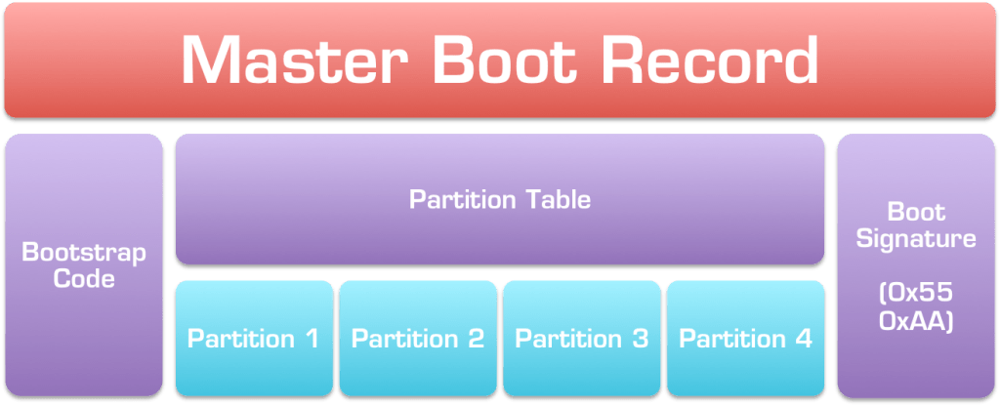
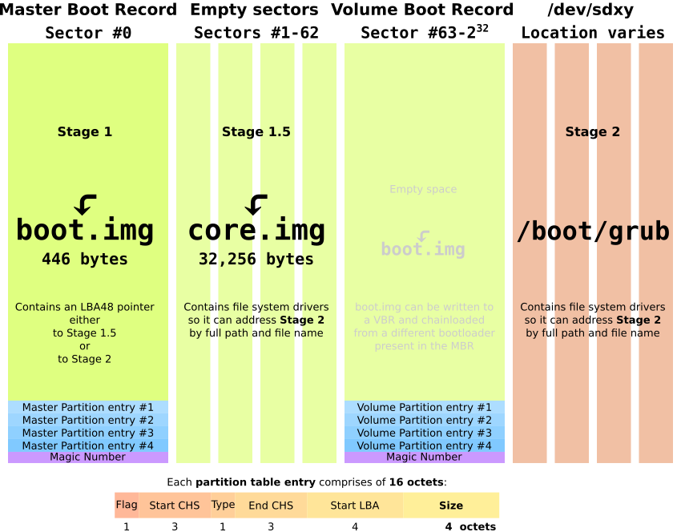

# Lec2 - Booting
## How Linux starts?
1. system start (BIOS)
2. stage 1 bootloader (MBR)
3. stage 2 bootloader (GRUB, LILO)
4. kernel (kernel space)
5. init (user space)

## System start
1. power on, working under "real mode"
2. CPU jumps to address `0xFFFFFFF0` in BIOS
   > BIOS shadow: copy ROM contents to RAM for faster access
3. BIOS Power On Self Test (POST)
4. initialize hardware
5. find bootable devices
6. copy MBR to `0x00007C00` and transfer control
7. OS

## Bootloader
### MBR

- MBR contains bootloader, OS starts from disks with MBR
- a 512-byte sector, located at the first sector (cylinder 0, head 0)
  - 446-byte bootloader
  - 4 * 16-byte partition table
  - 2-byte magic number
- BIOS transfers control to MBR after it has been loaded into RAM

### GRUB

> target: load kernel into memory
1. BIOS looks for bootable devices, then transfers control to MBR
2. MBR contains stage 1 of GRUB, which loads stage 1.5
3. GRUB stage 1.5 loads stage 2
4. GRUB stage 2 has control and shows the startup menu
5. GRUB loads the chosen (or default) kernel into memory and transfers control

## Kernel
- kernel is a compressed binary rather than an executable
  - zImage: less than 512 KB, put into RAM at `0x00010000`
  - bzImage: more than 512 KB, put into RAM at `0x00100000`
- kernel is always in memory until shutdown
- boot procedures
  1. `setup()`: reinitialize hardware and setup environment for kernel program execution
     - setup Interrupt Descriptor Table (IDT) and Global Descriptor Table (GDT)
     - switch from "real mode" to "protected mode"
  2. `(compressed) startup_32()`: decompress the kernel and load it to `0x00100000`
  3. `(kernel) startup_32()`: setup environment for process id 0
     - `setup_idt()` to initialize IDT with null interrupt handlers
     - load `gdtr` and `idtr` registers with addresses of GDT and IDT tables
  4. `start_kernel()`: complete initialization
     - `paging_init()` to initialize page tables
     - `mem_init()` to initialize page descriptors
     - `trap_init()` and `init_IRQ()` to finish initialization of IDT
     - `kmem_cache_init()` and `kmem_cache_size_init()` to initialize slab allocator
     - `time_init()` to initialize system date and time
     - `kernel_thread()` to create process id 1

## Init
- process id 1
- starts processes listed in `/etc/inittab`
  - run-level: when to start (single user / multiuser / reboot)
  - `systemd`: target-based (`multiuser = multi-user.target`)
- `init` also controls the order of termination of processes during shutdown
- procedures
  1. `do_basic_setup()` to do more about system initialization
  2. `free_initmem()` to release memory used during previous initialization
  3. open a console device (`/dev/console`)
  4. execute other init commands if any