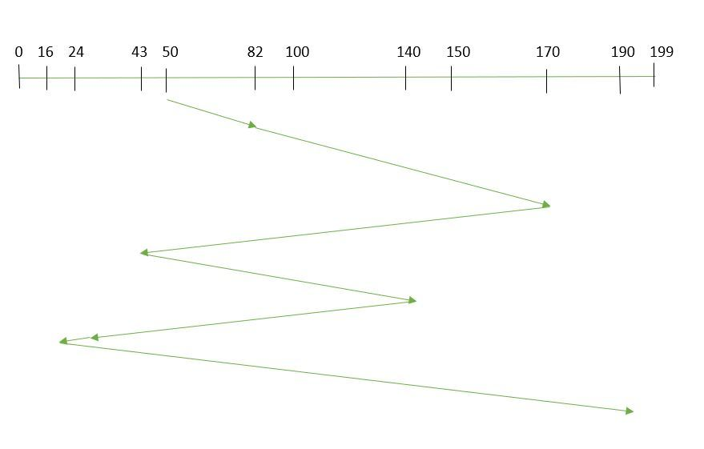
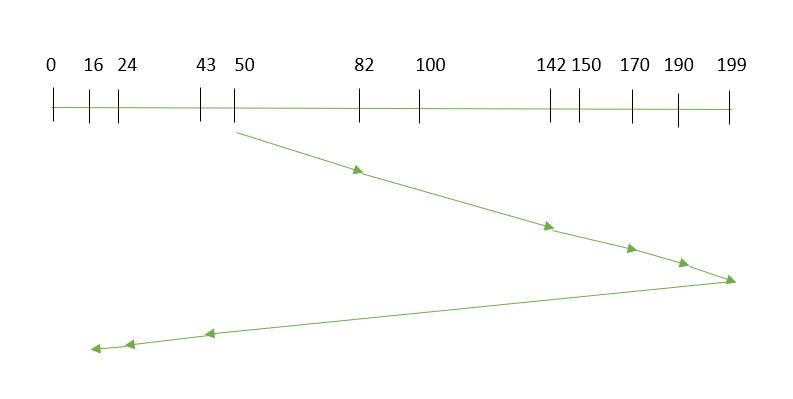

# Device Management
## Interrupt
- routine
  1. interrupt request
  2. interrupt response
  3. context switch
  4. interrupt service routine
  5. context switch
  6. continue
- types
  - i/o interrupt
  - clock interrupt
  - system request interrupt
  - alert interrupt
  - error
- implementation
  - interrupt request is checked after every execution
  - different priority
  - interrupt service routine vector
  - context switch
    1. finish current instruction
    2. push all register values on the stack
    3. LR is set to `0xFFFFFFF9`
    4. IPSR is set to the interrupt number
    5. PC is loaded with the interrupt vector
  - interrupt masking

## Clock
- types
  - system clock
  - time of day clock
  - realtime clock
- usage: periodic interrupts are counted by the interrupt handler to keep track of absolute of elapsed time, or used by the OS task scheduler to manage execution of running processes

## I/O
### Resources
- address
- interrupt
- DMA
- buffer
### Channel I/O
- a designated processor for I/O devices
- own instructions
- routine
  1. get channel program from CPU
  2. process
  3. interrupts CPU after completion
### I/O Buffer
- compensate speed difference
- hardware/software buffer
- types: double/ring/pool

## Disk Scheduling
> *Terms*
> - seek time: locate the disk arm to a specified track
> - rotational latency: rotate the desired sector to position
> - transfer time: data transfer
> - disk access time: seek time + rotational latency + transfer time

- FCFS (First Come First Served)

  - every request will be fulfilled
  - may be slow
- SSTF (Shortest Seek Time First)

  - faster response time
  - starvation may occur
- SCAN (elevator)

  - high throughput
  - request may wait for a longer period (but will be fulfilled eventually)
- C-SCAN (Circular SCAN)

  - more uniform wait time