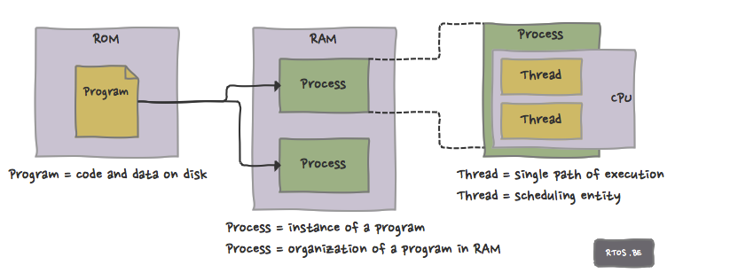

# Process Management
## Introduction
### Program vs Process vs Thread
- program: an executable file containing set of instructions to perform a specific job
- process: an executing instance of a program
- thread: the smallest executable unit of a process
- a process can have multiple threads, all threads of the same process share memory of that process

### Structure of a Process
- process control block (PCB): all information about a process
- code: read-only instructions and constants that can be executed simultaneously by different processes
- data: anything used by the process, e.g. variables
- workspace: stacks
  - kernel stack: used when the process is running in kernel mode
  - user stack: used when the process is running in user mode

## Scheduling
### Types of Schedulers
- long-term (job) scheduler: select processes from pool and loads them into memory for execution
- short-term (CPU) scheduler: select processes which are ready to execute
- medium-term (process swapping) scheduler: re-introduce the process into memory and execution can be continued

### Scheduling Disciplines
- FIFO: first-come-first-served, queue processes in the order they arrive in the ready queue, low throughput but no starvation
- round-robin: each process is assigned a fixed time. if process completes within that time-slice it gets terminated, otherwise it is rescheduled after all other processes have executed once
- priority: each process is assigned a fixed priority during initialization, and a dynamic priority that changes during scheduling
  - higher fixed priorty: system processes, shorter jobs, i/o busy
  - increase of dynamic priorty: i/o stage of a CPU-busy process, interaction stage of a interactive process, processes that have waited too long
  - decrease of dynamic priorty: CPU stage of a CPU-busy process, processes that have been executed for too long
- multilevel queue: used for situations in which processes are easily divided into different groups. For example, foreground (interactive) processes and background (batch) processes. These two types of processes have different response-time requirements and so may have different scheduling needs